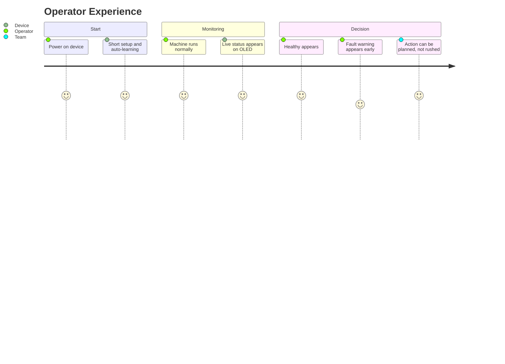
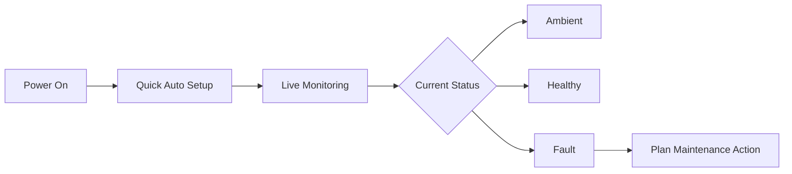

# Industrial Doctor v2.0
## Smart Health Companion for Rotating Machines

> From machine pulse to digital diagnosis.

<p align="center">
    
    
    
</p>

<p align="center">
Industrial Doctor v2.0 listens to machine behavior in real time and gives a simple, clear health status.
</p>

---

## Why This Project Exists

Many machines fail after subtle warning signs that are easy to miss by ear.
Industrial Doctor v2.0 was built to act like an always-on digital inspector that helps teams:

- Catch issues earlier.
- Reduce surprise downtime.
- Make maintenance decisions with confidence.
- Keep operations safer and more predictable.

---

## What It Feels Like In Real Use



---

## At a Glance

| Area | What It Means For People |
| :-- | :-- |
| Real-time Listening | The device continuously checks machine sound behavior while running. |
| Auto Setup | No complicated tuning process for day-to-day operation. |
| Clear Result | Easy-to-read status on the display: Ambient, Healthy, or Fault. |
| Field Friendly | Designed for practical use around motors and rotating equipment. |

---

## System Status Screens

### Ambient State

Use this block for your OLED photo when the machine is in Ambient state.

```text
[ Insert Ambient OLED Photo Here ]
```

Suggested caption:

Ambient mode: no meaningful machine activity detected, monitoring remains active.

### Healthy State

Use this block for your OLED photo when the machine is in Healthy state.

```text
[ Insert Healthy OLED Photo Here ]
```

Suggested caption:

Healthy mode: machine behavior is stable and operating as expected.

---

## Purpose

Industrial Doctor v2.0 is built to be a practical predictive maintenance assistant.
Its purpose is to help people quickly understand machine condition without needing deep technical analysis.

---

## Scope

This project focuses on:

- Monitoring rotating machinery condition in real time.
- Providing clear health feedback to non-specialist users.
- Supporting early maintenance planning.

This project does not focus on:

- Showing internal scientific formulas.
- Exposing proprietary decision logic.
- Replacing full laboratory-grade diagnostics.

---

## Who This Is For

- Plant operators.
- Maintenance supervisors.
- Production managers.
- Teams that want earlier warning before breakdowns.

---

## Hardware Snapshot

| Component | Role |
| :-- | :-- |
| ESP32 Device | Runs the on-device intelligence and status logic. |
| Digital Microphone | Captures machine sound signature. |
| OLED Display | Shows live machine condition clearly. |

---

## Quick Storyboard



---

## Project Positioning

Industrial Doctor v2.0 is a practical bridge between machine behavior and human decision-making.
It is designed to be understandable, dependable, and useful in real operating environments.

---

## Privacy Of Core Methods

This README is intentionally non-technical.
Internal science, formulas, and proprietary implementation details are intentionally excluded.
