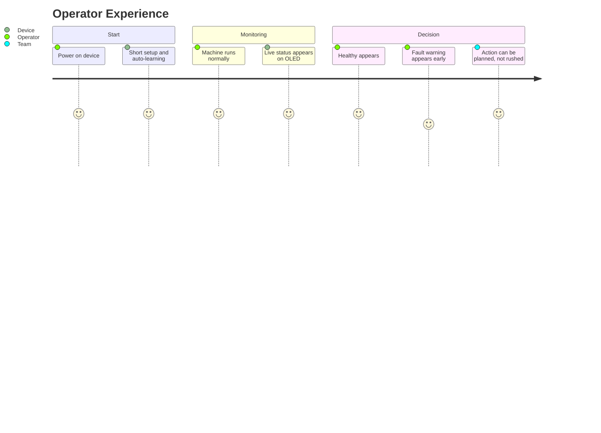
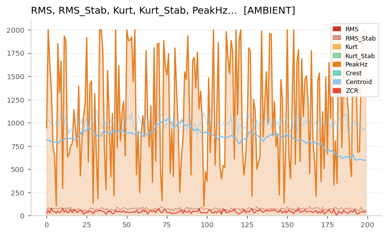
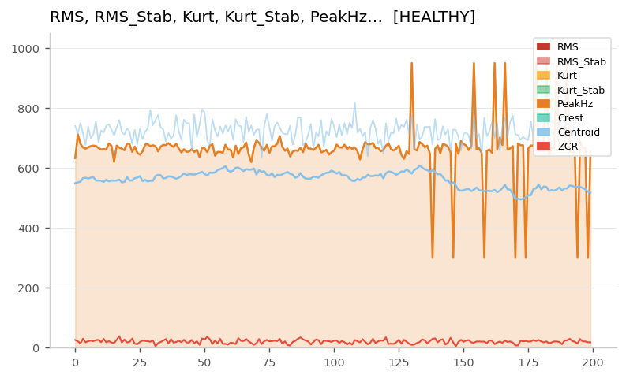
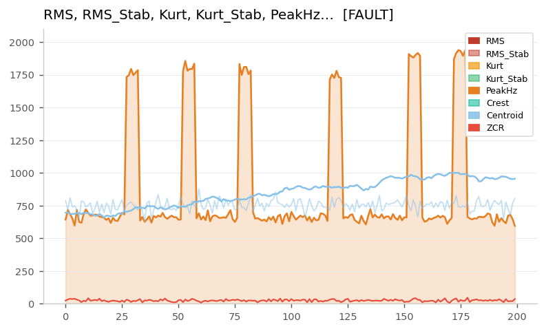
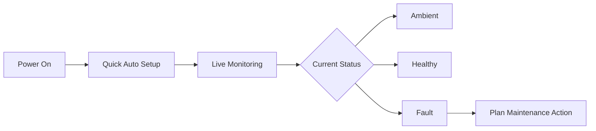

# Industrial Doctor v2.0
## Smart Health Companion for Rotating Machines
> From machine pulse to digital diagnosis.

<p align="center">
    
    
    
</p>

<p align="center">
Industrial Doctor v2.0 listens to machine behavior in real time and gives a simple, clear health status.
</p>

---

## Why This Project Exists

Many machines fail after subtle warning signs that are easy to miss by ear.
Industrial Doctor v2.0 was built to act like an always-on digital inspector that helps teams:

- Catch issues earlier.
- Reduce surprise downtime.
- Make maintenance decisions with confidence.
- Keep operations safer and more predictable.

---

## What It Feels Like In Real Use



---

## At a Glance

| Area | What It Means For People |
| :-- | :-- |
| Real-time Listening | The device continuously checks machine sound behavior while running. |
| Auto Setup | No complicated tuning process for day-to-day operation. |
| Clear Result | Easy-to-read status on the display: Ambient, Healthy, or Fault. |
| Field Friendly | Designed for practical use around motors and rotating equipment. |

---

## System Status Screens

The device transitions between three clearly defined states. Each state has a distinct signal signature and a matching on-device display.

---

### 🔵 Ambient State

The machine is powered off or no meaningful mechanical activity is detected. The system remains active and listening, but no significant vibration or acoustic signature is present.

**What the signal looks like:**



> In Ambient, the PeakHz line (orange) is extremely volatile — swinging wildly across the full 0–2000 range with no stable pattern. This is background environmental noise with no mechanical source. The RMS and Centroid values (blue) also shift unpredictably. There is no rhythm, no consistency. The system recognises this disorder as the absence of machine activity.

**OLED Display — Ambient State:**

```text

```

> Ambient mode: no meaningful machine activity detected, monitoring remains active.

---

### ✅ Healthy State

The machine is running normally. Signal features are stable and within expected bounds. No intervention is needed.

**What the signal looks like:**



> In Healthy mode, the PeakHz line (orange) sits in a tight, stable band around 650–700 Hz for most of the session. The RMS and Centroid (blue) move gradually and smoothly, without sudden jumps. Toward the later segment, some natural variation appears as load shifts — but this stays within the expected envelope. The overall picture is calm, consistent, and predictable.

**OLED Display — Healthy State:**

```text

```

> Healthy mode: machine behavior is stable and operating as expected.

---

### ⚠️ Fault State

An anomaly has been detected. The signal shows characteristics that deviate from the healthy baseline. The system flags this early so action can be planned rather than forced.

**What the signal looks like:**



> In Fault mode, the PeakHz line (orange) is mostly stable — but interrupted by sharp, isolated spikes that shoot to 1700–2000 Hz before returning to baseline. These sudden impulse events are the key fault indicator. Unlike Ambient noise (which is continuously chaotic), these spikes are brief, repeating, and structurally distinct. The RMS and Centroid (blue) may dip slightly around fault events. The pattern points to friction, impact, or a developing mechanical irregularity.

**OLED Display — Fault State:**

```text


```

> Fault mode: anomaly detected — early warning issued, plan maintenance action.

---

## State Comparison Summary

| Feature | Ambient | Healthy | Fault |
| :-- | :-- | :-- | :-- |
| PeakHz Behaviour | Chaotic, full range | Stable, narrow band | Stable with sharp impulse spikes |
| RMS / Centroid | Unpredictable | Smooth and gradual | Slightly unstable around spikes |
| ZCR | Variable | Low and quiet | Low with brief bursts |
| Interpretation | No machine activity | Normal operation | Developing mechanical issue |
| Recommended Action | None | Continue monitoring | Schedule inspection |

---

## Purpose

Industrial Doctor v2.0 is built to be a practical predictive maintenance assistant.
Its purpose is to help people quickly understand machine condition without needing deep technical analysis.

---

## Scope

This project focuses on:

- Monitoring rotating machinery condition in real time.
- Providing clear health feedback to non-specialist users.
- Supporting early maintenance planning.

This project does not focus on:

- Showing internal scientific formulas.
- Exposing proprietary decision logic.
- Replacing full laboratory-grade diagnostics.

---

## Who This Is For

- Plant operators.
- Maintenance supervisors.
- Production managers.
- Teams that want earlier warning before breakdowns.

---

## Hardware Snapshot

| Component | Role |
| :-- | :-- |
| ESP32 Device | Runs the on-device intelligence and status logic. |
| Digital Microphone | Captures machine sound signature. |
| OLED Display | Shows live machine condition clearly. |

---

## Quick Storyboard



---

## Project Positioning

Industrial Doctor v2.0 is a practical bridge between machine behavior and human decision-making.
It is designed to be understandable, dependable, and useful in real operating environments.

---

## Privacy Of Core Methods

This README is intentionally non-technical.
Internal science, formulas, and proprietary implementation details are intentionally excluded.
