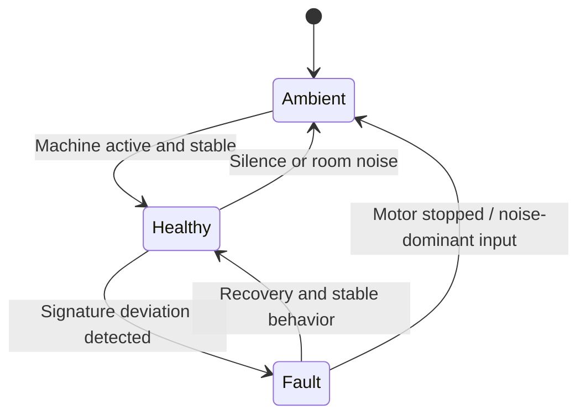

# Industrial Doctor v2.0
## Edge-AI Predictive Maintenance for Rotating Machinery

> From machine pulse to digital diagnosis.

Industrial Doctor v2.0 is an embedded diagnostic system built for ESP32-class hardware. It performs real-time acoustic fingerprinting and statistical inference to identify early signs of failure in rotating machinery. Instead of relying on simple thresholds, the system evaluates a 7-dimensional feature vector to separate normal drift from true mechanical anomalies.

## Visual Overview

### End-to-End Signal Path

### Runtime State Model

## Key Features

- High-Speed I2S DSP: Real-time 32-bit digital audio processing at 16 kHz for high-fidelity vibration analysis.
- 7-Axis Feature Extraction: RMS, ZCR, Spectral Centroid, Peak Frequency, Kurtosis, Crest Factor, and RMS Stability.
- Autonomous Calibration: Learns a healthy baseline in around 10 seconds for hardware-agnostic deployment.
- Intelligent Veto System: Suppresses false positives from silence, speech, and non-machine environmental noise.
- Dual-Fault Classification: Distinguishes friction/wear patterns from rotational unbalance patterns.

## The Science: Z-Score Inference

The inference layer is based on statistical Z-score analysis. The engine tracks how far live behavior moves from the learned baseline, expressed in standard deviations from the mean.

- Mean: baseline operating center.
- Standard deviation: expected spread around baseline.
- Z-score: distance from baseline in units of spread.

Higher absolute Z-score movement indicates stronger deviation from normal machine behavior.

### Acoustic Fingerprints (Data-Driven)

| Feature | Friction Mode | Unbalanced Mode | Crowd Noise (Veto) |
| :-- | :-- | :-- | :-- |
| ZCR | +4.05 sigma (Extreme Rise) | -3.22 sigma (Extreme Drop) | -0.42 sigma (Near Normal) |
| Centroid | +1.34 sigma (Bright) | -3.05 sigma (Dark/Deep) | +5.42 sigma (Very Bright) |
| PeakHz | +0.53 sigma | -1.78 sigma | +2.46 sigma (Scattered) |

## Feature Dashboard Snapshot

Relative role in diagnosis pipeline (qualitative view):

| Feature | Diagnostic Role | Relative Weight in Decision Context |
| :-- | :-- | :-- |
| RMS | Energy envelope | #### |
| RMS Stability | Consistency and chatter | ##### |
| Peak Frequency | Dominant rotational signature | ### |
| Spectral Centroid | Brightness / tonal shift | #### |
| ZCR | Rhythmic regularity vs disorder | ##### |
| Kurtosis | Impulse severity | ### |
| Crest Factor | Shock transients | ### |

## Hardware Architecture

- Microcontroller: ESP32 (dual-core, 240 MHz class)
- Sensor: INMP441 / ICS-43434 MEMS I2S microphone
- Display: 128x64 SSD1306 OLED over I2C
- Core Logic: Custom C++ statistical inference engine

## System States

| State | Description |
| :-- | :-- |
| Ambient | Veto logic identifies silence or room noise; baseline-protect mode. |
| Healthy | Operation remains inside the learned safe envelope. |
| Fault | Friction or unbalance voter signatures exceed expected behavior. |

## Repository Structure (Showcase)

- src/main.cpp: Firmware orchestration, OLED state rendering, and telemetry flow.
- include/feature_extraction.h: Audio DSP feature pipeline and I2S-facing interfaces.
- include/anomaly_engine.h: Baseline calibration and statistical scoring interfaces.
- include/diagnosis_voter.h: Final decision layer and veto-rule interfaces.

## Professional Statement

Industrial Doctor v2.0 demonstrates edge-AI engineering focused on interpretability, latency control, and deployment practicality. The system favors transparent statistical behavior over opaque black-box-only decisions, supporting maintainable predictive maintenance workflows in constrained embedded environments.

## Disclosure Boundary

This README intentionally presents architecture and public-facing behavior only. Proprietary tuning details, internal calibration constants, and implementation-specific decision heuristics are not disclosed here.
